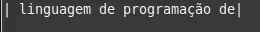

# Tools
Scripts curtos, e úteis.

<details>
  <summary> Listar Arquivos </summary><br>

O código lista todos arquivos disponiveis em uma pasta(de sua preferencia).<br>

O script le o nome dos arquivos presentes, e usando with open, armazena toda informação em um arquivo de texto.<br>

```python
import glob # Módulo glob

# PROCURA NO DIRETORIO TODOS ARQUIVOS.
listar_arquivo = glob.glob('*.*') # No trecho " glob.glob('*.*') " Existem dois asteriscos:
    # 1º Nome do Arquivo
    # 2° Nome da Extensão

with open("Lista_Nome_Arquivos.txt","w") as f:
    for linha in listar_arquivo:
        f.write(linha+"\n")
```

  Para instalar o módulo digite:<br>
  ```  $ pip install glob2  ```
  
</details>

<details>
  <summary>Envio de E-mail (smtplib)</summary><br>
  
  Envia e-mail via Python.<br>

```python
import smtplib

server = smtplib.SMTP('smtp.gmail.com:587') # GOOGLE
#server = smtplib.SMTP("smtp.live.com:587") # OUTLOOK

server.starttls()
endmail = "" # SEU ENDEREÇO DE E-MAIL 
pswd = "" # SUA SENHA
from_mail = "" # ENDEREÇO DE E-MAIL PARA ENVIO
server.login(endmail,pswd)
try: 
#cria uma variavel com o corpo da mensagem
    message = ('Variavel responsavel pelo armazenamento da mensagem')
    server.sendmail(endmail, from_mail ,message)
    print("Mensagem enviada com sucesso") 
# Caso haja queda na conexao de email, realize o login novamente    
except smtplib.SMTPServerDisconnected:
    print("Erro de conexao SMTPServerDisconnected")
    server.starttls()
    server.ehlo()
    server.login(endmail,pswd)     
```

  Para instalar o módulo digite:<br>
  ```  $ pip install smtp   ```

</details>
<details>
  <summary>Brincando com Strings</summary><br>
  <details>
    <summary>- Letreiro</summary><br>

Esse código "simula" um letreiro de led.



```python
#!/usr/local/bin/python
# -*- coding: utf-8 -*-

from os import system #
from time import sleep #

# Texto de Exemplo

texto = "Python é uma linguagem de programação de alto nível,[4] interpretada, de script, imperativa, orientada a objetos, funcional, de tipagem dinâmica e forte. Foi lançada por Guido van Rossum em 1991.[1] Atualmente possui um modelo de desenvolvimento comunitário, aberto e gerenciado pela organização sem fins lucrativos Python Software Foundation. Apesar de várias partes da linguagem possuírem padrões e especificações formais, a linguagem como um todo não é formalmente especificada. O padrão de facto é a implementação CPython. A linguagem foi projetada com a filosofia de enfatizar a importância do esforço do programador sobre o esforço computacional. Prioriza a legibilidade do código sobre a velocidade ou expressividade. Combina uma sintaxe concisa e clara com os recursos poderosos de sua biblioteca padrão e por módulos e frameworks desenvolvidos por terceiros. "

comeco = 0
fim = 30
while fim < len(texto): # Enquanto o "fim" for menor que o tamanho total do texto, faca:
	comeco += 1 # Adciona um ao começo
	fim += 1    # Adciona um ao fim
	system('clear') # Limpa a tela (Funciona melhor em um terminal)
	sleep(0.2) # Espera 0,2 segundos
	print("|{}|".format(texto[comeco:fim])) # printa o texto da variavel "comeco" a variavel "fim"
  ```
  </details>
</details>
